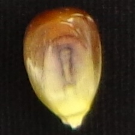
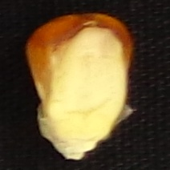
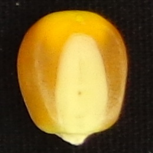
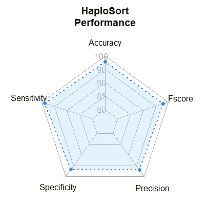

# HaploSort

**HaploSort** is a *convolutional neural network (CNN)* develop to classify haploid maize seeds based on seed images obtained from induction progenies using haploid inducers equipped with the *R1-nj* marker.

More details about the development of **Haplosort** are available on **paper**.

## Background

*Doubled haploid* (DH) technology is employed to accelerate the development of new maize lines. Briefly, the DH technique consists of obtaining haploids individuals, identification od haploid within induction crosses, and an artificial chromosomal doubling of haploid seedlings. This method permits shorten the time used in this stage.
In maize, the principal method applied to obtain haploid individuals is using an *in vivo* haploid inducer. These inducers are genotypes that have a high rate of haploid individuals in their progenies. Overall, seeds obtained from induction crosses can be haploids or diploids, and the main system used to sort them is the *R1-nj* marker, according to images below:

**diploid (D)**|**haploid (H)**|**inhibited (I)**
:---------:|:---------:|:--------:
 |  | 

However, the anthocyanin expressiveness is variable, which makes it difficult to distinguish between seed classes. We developed a CNN model to classify accurately haploid maize seeds using *R1-nj* avoiding sorting mistakes.

## Performance

HaploSort was highly accurate for maize haploid seed sorting task. Below are the performance metrics:

<table border='0'>
    <tr>
        <td>

Metrics|values
 :-|:- 
Accuracy | **94.39**
Sensitivity| **97.07**
Specificity | **91.71**
Precision | **92.13**
Fscore | **94.54**

</td>
        <td>  </td>
    </tr>
</table>

---

## Requirements

### ***Packages***

First of all, you should install the following software and packages to use **Haplosort**:

* Python 3 (<https://www.python.org/>)
* Tensorflow (<https://www.tensorflow.org/>)
* Keras (<https://keras.io/>)
* numpy
* pandas

### ***How to run the HaploSort?***

**1.** Download the repository by clicking on the button or type the following command in CMD to clone the repository

`git clone https://github.com/sabadinfelipe/haplosort.git`

**2.** Into `dataset` directory, there are 60 seed image examples (30 haploids and 30 diploida). To predict them, run the following code:

`python haplosort.py`

**3.** Results are stored in an `output.csv` file, which contains two columns: `file_name` and `phenotype`. The `file_name` column is composed of image filenames, whereas the `phenotype` column is its prediction. Below, it follows an output example:

**file_name**|**phenotype**
:---------:|:---------:
diploid_1.jpg | D
haploid_5.jpg | H
diploid_2.jpg | D
diploid_10.jpg | D

### ***Predicting your image dataset***

If you want to predict your seed images, delete image files into the `dataset`directory, and move your image dataset to it. After, run the `haplosort.py` script to predict them. It will create an `output.csv` file containing the predictions. 

## Citation

paper

## Acknowledgments

I would like to thank **Allogamous Plant Breeding Laboratory** team for supporting in this project.

Please report any question or bug to this [email](mailto:felipe.sabadin@usp.br).

## More about us

[Allogamous Plant Breeding Lab, University of São Paulo - Brazil](http://www.genetica.esalq.usp.br/alogamas/)

